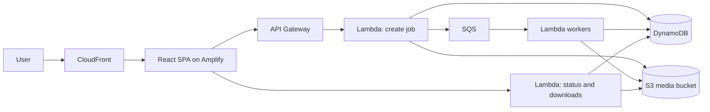

<div align="center">

# SuperDoc

**Convert, edit, and transform documents without dark patterns.**

[](https://superdoc.pablobhz.cloud)
[](frontend/package.json)
[](infra)
[](handlers)

[Open SuperDoc](https://superdoc.pablobhz.cloud)

</div>

SuperDoc is a serverless file utility for everyday document work: converting, editing, extracting, and packaging common office, PDF, image, spreadsheet, and markdown formats. It is built as a public web app with short-lived storage, event-driven processing, and infrastructure managed in Terraform.

## Why It Exists

Most file conversion sites make users trade privacy, time, or trust for simple tasks. SuperDoc aims to keep the workflow direct:

- Upload a file.
- Pick a valid operation.
- Process it in isolated serverless workers.
- Download the result.
- Let temporary files expire automatically.

The project is intentionally pragmatic: it favors simple operations, bounded retention, and transparent infrastructure over account lock-in or ad-heavy conversion funnels.

## What It Does

SuperDoc currently focuses on document and media utility workflows:

| Area | Examples |
| --- | --- |
| PDF | extract text, convert to images, generate downloads |
| DOCX | convert to PDF or text, edit document content |
| XLSX | convert to CSV or PDF, edit spreadsheets |
| Markdown | convert markdown into downloadable document formats |
| Images | convert images and prepare transformed outputs |
| User files | create, list, complete, and download short-lived files |

The frontend presents the available actions based on file type and sends jobs through the API. Backend handlers validate operations, track status, store artifacts in S3, and return presigned download URLs.

## Architecture



The runtime is split into focused Lambda handlers rather than a monolith. Shared behavior lives in Lambda layers under `layers/`, while Terraform modules define the AWS resources used by each environment.

### AWS Shape

| Layer | Service |
| --- | --- |
| Web app | React + Vite deployed through AWS Amplify |
| Edge | CloudFront |
| API | API Gateway |
| Compute | AWS Lambda, Python 3.12 |
| Queueing | SQS standard queue |
| State | DynamoDB with TTL-oriented job records |
| Storage | S3 for temporary upload and output objects |
| Identity | Cognito-backed session support |
| DNS | Route 53 for `superdoc.pablobhz.cloud` |
| IaC | Terraform modules and environment roots |

## Stack

- **Frontend:** React 18, Vite, React Router, TipTap, Fabric, PDF and Office document helpers.
- **Backend:** Python Lambda handlers with shared utilities in `layers/superdoc_utils`.
- **Infrastructure:** Terraform modules for Amplify, API Gateway, Lambda, S3, DynamoDB, SQS, CloudFront, Cognito, ACM, Route 53, SSM, and monitoring.
- **Testing:** Vitest, Playwright, Pytest, Terraform validation, and targeted smoke scripts.
- **Delivery:** GitHub Actions and deployment scripts for packaged handlers, layers, frontend assets, and Terraform-managed infrastructure.

## Repository Layout

```text
.
├── frontend/              # React + Vite web app
├── handlers/              # Python Lambda entrypoints
├── layers/                # Shared Lambda layer code and dependencies
├── infra/                 # Terraform root, modules, and environments
│   ├── modules/           # Reusable AWS modules
│   └── environments/      # dev, stage, and prod entrypoints
├── office_image/          # Office conversion image requirements
├── scripts/               # Build, smoke, deploy, and hygiene scripts
├── tests/                 # Python backend tests
└── docs/                  # Supporting project documentation
```

## Local Development

### Frontend

```bash
cd frontend
npm install
cp .env.example .env.local
npm run dev
```

Set `VITE_API_URL` in `frontend/.env.local` to point at the API Gateway stage you want to use.

Useful frontend commands:

```bash
cd frontend
npm run build
npm run test
npm run test:e2e
npm run lint
```

### Backend

Most backend code runs as Lambda handlers, but the shared Python behavior is testable locally:

```bash
pip install pytest python-hcl2
pytest tests -v
```

Layer and handler packaging helpers live in `scripts/`:

```bash
bash scripts/build_layers.sh
bash scripts/build_handlers.sh
```

### Infrastructure

Bootstrap Terraform state once, then work from an environment directory:

```bash
cd infra/bootstrap_backend
terraform init
terraform apply -var='bucket_name=superdoc-tfstate-<account_id>'
```

For normal environment work:

```bash
cd infra/environments/dev
terraform init
terraform plan
terraform apply
```

Validation from the root:

```bash
cd infra
terraform fmt -recursive
terraform validate
pytest tests -v
```

## Testing

Run the suites closest to the code you changed:

```bash
# Frontend unit tests
cd frontend
npm run test

# Browser flows
cd frontend
npm run test:e2e

# Backend and infrastructure tests
pytest tests -v
pytest infra/tests -v
```

Smoke and deployment-oriented scripts are intentionally explicit:

```bash
bash scripts/smoke-api.sh
python scripts/local-v1-smoke.py
bash scripts/redeploy_frontend.sh
```

## Operational Notes

- Uploads and generated outputs are designed to be temporary.
- DynamoDB stores job state and expiration metadata.
- S3 lifecycle and presigned URLs keep file access bounded.
- Terraform environment roots separate `dev`, `stage`, and `prod`.
- Customer-managed KMS can be enabled for media S3 and DynamoDB in supported environments.
- The public app lives at [superdoc.pablobhz.cloud](https://superdoc.pablobhz.cloud).

## Code Hygiene

The repo includes local scripts for comment and generated-reference hygiene:

```bash
bash scripts/inventory_comments_needed.sh
bash scripts/strip_generated_refs.sh
bash scripts/install_git_hooks.sh
```

Comments should explain why a branch exists, not restate the code.

## Project History

SuperDoc started as a compact serverless document converter and has grown into a broader file workspace: conversion flows, document editors, authenticated user files, operation validation, and environment-specific AWS infrastructure. The current direction is to keep the product useful without making the architecture heavy: a React SPA, narrow Lambda handlers, short-lived files, and Terraform-managed cloud resources.

## Contributing

Contributions should keep the system boring in the best way:

1. Keep user files temporary unless a feature explicitly requires persistence.
2. Add or update tests for new operations and user-visible flows.
3. Prefer existing shared utilities in `layers/superdoc_utils`.
4. Keep Terraform changes modular and environment-aware.
5. Run the smallest meaningful test set before opening a change.

For larger changes, include the user flow, AWS resources touched, rollback notes, and expected cost impact in the pull request description.
