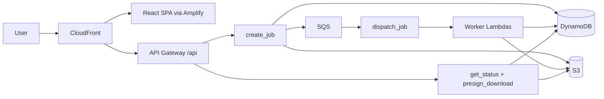

<div align="center">

# SuperDoc

**Convert, edit, and transform documents without dark patterns.**

[](https://superdoc.pablobhz.cloud)
[](frontend/package.json)
[](infra)
[](handlers)

[Open SuperDoc](https://superdoc.pablobhz.cloud)

</div>

SuperDoc is a serverless file utility for everyday document work: converting, editing, extracting, and packaging common office, PDF, image, spreadsheet, and markdown formats. It runs as a public web app with short-lived storage, event-driven processing, and infrastructure managed entirely in Terraform.

## Why It Exists

Most file conversion sites make users trade privacy, time, or trust for simple tasks. SuperDoc keeps the workflow direct:

- Upload a file.
- Pick an operation (convert or edit).
- Process it in isolated serverless workers.
- Download the result.
- Let temporary files expire automatically (12h for anonymous, 7 days for authenticated).

No accounts required, no ad funnels, no subscription lock-in.

## What It Does

| Area | Operations |
| --- | --- |
| PDF | to DOCX, TXT, Markdown, HTML, Images (ZIP); extract text (JSON); edit in browser |
| DOCX | to PDF, TXT, Markdown, HTML, Images (ZIP); WYSIWYG editor |
| XLSX | to CSV, PDF, TXT, Markdown, HTML, DOCX, Images (ZIP); spreadsheet editor |
| Markdown | to PDF, DOCX, HTML, Images; edit in browser |
| HTML | to PDF, DOCX, TXT, Images |
| Images | format conversion (PNG, JPG, WebP, GIF); to PDF; OCR to TXT/MD/DOCX; image editor |

The frontend presents available actions based on file type via a dynamic operation catalog. Backend handlers validate, process, store artifacts in S3 with TTL, and return presigned download URLs.

## Architecture



### AWS Services Used

| Layer | Service |
| --- | --- |
| Edge / CDN | CloudFront (custom domain + /api origin routing) |
| Web hosting | Amplify (manual deploy of pre-built dist/) |
| API | API Gateway REST with Cognito authorizer |
| Compute | 26 Lambda functions (Python 3.12, Zip packaging) |
| Queue | SQS standard queue with single dispatcher pattern |
| State | DynamoDB (jobs, api_keys, incidents, rate_limits, auth_sessions, payments) |
| Storage | S3 with lifecycle TTL for temporary files |
| Auth | Cognito user pool + session Lambda |
| DNS | Route 53 for superdoc.pablobhz.cloud |
| Certificates | ACM |
| Monitoring | CloudWatch alarms, SNS alerts, budget alarm at $5 |
| Secrets | SSM Parameter Store (Stripe keys) |
| IaC | Terraform with 13 reusable modules |

## Stack

- **Frontend:** React 18, Vite, React Router, TipTap (WYSIWYG), Fabric.js (image editor), i18n (en-US / pt-BR), Azure + Dark themes.
- **Backend:** Python Lambda handlers with shared utilities in `layers/superdoc_utils` (operations catalog, validation, DynamoDB/S3 helpers, structured logging).
- **Infrastructure:** Single Terraform root (`infra/`) with modules for each AWS service.
- **Testing:** Vitest for frontend, Pytest for backend, Playwright for E2E.

## Repository Layout

```text
.
├── frontend/              # React + Vite web app
│   ├── src/
│   │   ├── components/    # Layout, shared UI
│   │   ├── context/       # Auth, Theme, I18n providers
│   │   ├── hooks/         # useJob, custom hooks
│   │   ├── i18n/          # en-US.json, pt-BR.json
│   │   ├── lib/           # api.js, session.js
│   │   ├── pages/         # Home, editors, processing, settings
│   │   └── styles/        # themes.css, index.css
│   └── dist/              # Pre-built output (deployed to Amplify)
├── handlers/              # Python Lambda entrypoints (one per operation)
├── layers/                # Shared Lambda layers (superdoc_utils, python_deps)
├── infra/                 # Terraform root module
│   ├── modules/           # acm, amplify, api_gateway, budget, cloudfront,
│   │                      # cognito, dynamodb, lambda, lambda_layer,
│   │                      # monitoring, route53, s3, sqs, ssm
│   └── environments/      # dev, prod, stage entrypoints (S3 backend state)
├── tests/                 # Python backend tests
└── docs/                  # Supporting documentation
```

## Local Development

### Frontend

```bash
cd frontend
npm install
npm run dev
```

Set `VITE_API_URL` in a local `.env` to point at the deployed API Gateway stage.

```bash
npm run build        # Build dist/
npm run test         # Vitest
npm run test:e2e     # Playwright
npm run lint         # ESLint
```

### Backend

Handlers are Lambda entrypoints. Shared code lives in `layers/superdoc_utils/`. Test locally with:

```bash
pip install pytest
pytest tests -v
```

### Infrastructure

```bash
cd infra/environments/prod
terraform init
terraform plan
terraform apply

# Validation from root:
cd infra
terraform fmt -recursive
terraform validate
```

The Terraform root module is `infra/`. Environment entrypoints (`infra/environments/dev/`, `prod/`, `stage/`) call the root module with environment-specific variables. State is stored in S3 (`superdoc-tfstate` bucket). Variables are supplied via `.tfvars` files (not committed).

## Deployment

The frontend is deployed as a **manual static upload** to AWS Amplify:

```bash
cd frontend
npm run build
aws amplify start-deployment --app-id d1nt18fa4ahgcn --branch-name main \
  --source-url "$(aws s3 presign s3://...)"
# Or via the Amplify console: upload dist/ as a manual deploy
```

Lambda handlers are packaged as ZIP files, uploaded to a private S3 bucket, and referenced by Terraform via `s3_key` variables. After updating handler code:

1. Package the handler ZIP
2. Upload to the handlers S3 bucket
3. Run `terraform apply` to update Lambda function code

## Operational Notes

- File retention: 12h anonymous, 7 days authenticated (via TTL_SECONDS env vars).
- DynamoDB TTL handles automatic expiration of job records.
- S3 lifecycle rules expire objects matching the same retention windows.
- Budget alarm triggers at $5/month; auto-disable Lambda kills anonymous access at $20.
- Video processing Lambda exists but is disabled (`reserved_concurrent_executions = 0`).
- Stripe checkout infrastructure is deployed but dormant (SSM keys are placeholders).

## Project History

SuperDoc started as a compact serverless document converter and has grown into a broader file workspace: conversion flows for 30+ format pairs, client-side editors (PDF, DOCX, XLSX, Markdown, Image), authenticated user file management, and a dynamic operation catalog. The architecture remains intentionally lightweight: a React SPA, narrow Lambda handlers, short-lived files, and Terraform-managed infrastructure.
